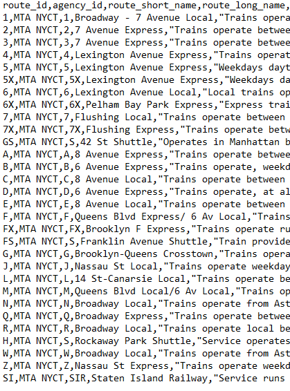

# HW7 API Data - NYC MTA API

Authors:  **Ling Lin**, **Xuanyu Lu** and **Qingyang Xiao**

---

## Introduction(Qingy)
Our team choose NYC MTA API to access its real-time data feed for analyses, the API key by MTA.
- *The type of data importing is All NYC 30 subway lines from route "1" to "SI", each line at all its stop_id expected arrival time.* 

- Route information:



- Specific train newest expected arrival time at each stop:


- Latitude and Longtitude of each subway stop:


- *The source of the data is provided on MTA website: (http://web.mta.info/developers/index.html).*  
- *By our code running, we see the data is updated real-time.*

To request data from the MTA, you'll also need a free API key.
[Register here](https://api.mta.info/).

---

## Sources

References for API
- The source code came from [a GitHub repository.](https://github.com/nolanbconaway/underground)
- The code retrieves data from [NYC MTA.](https://datamine.mta.info/)

References used in Transform API data to Python Dataframe section
- [Convert dataframe index to a new column](https://thispointer.com/pandas-convert-dataframe-index-into-column-using-dataframe-reset_index-in-python/)
- [Rename dataframe column](https://pandas.pydata.org/pandas-docs/stable/reference/api/pandas.DataFrame.rename.html)
- [Add a new column to a specific postion of dataframe](https://discuss.codecademy.com/t/can-we-add-a-new-column-at-a-specific-position-in-a-pandas-dataframe/355842)
- [Extract time information from Timestamp](https://pandas.pydata.org/pandas-docs/stable/reference/api/pandas.Timestamp.html)

References used in Data Visualization section
- [Add variable to plot title](https://stackoverflow.com/questions/43757820/how-to-add-a-variable-to-python-plt-title)
- [Lable data points on plot](https://stackoverflow.com/questions/14432557/matplotlib-scatter-plot-with-different-text-at-each-data-point)

---

## Explanation of the Code
*In this section you should provide a more detailed explanation of what, exactly, the above code actually does.  Your classmates should be able to read your explanation and understand what is happening in the code.*

The code, `needs_a_good_name.py`, begins by importing necessary Python packages:
```
import matplotlib.pyplot as plt
```

- *NOTE:  If a package does not come pre-installed with Anaconda, you'll need to provide instructions for installing that package here.*

We then import data from [insert name of data source].  We print the data to allow us to verify what we've imported:
```
x = [1, 3, 4, 7]
y = [2, 5, 1, 6]

for i in range(0,len(x)):
	print "x[%d] = %f" % (i, x[i])		
```
- *NOTE 1:  This sample code doesn't actually import anything.  You'll need your code to grab live data from an online source.*  
- *NOTE 2:  You will probably also need to clean/filter/re-structure the raw data.  Be sure to include that step.*

Finally, we visualize the data.  We save our plot as a `.png` image:
```
plt.plot(x, y)
plt.savefig('samplefigure.png')	
plt.show()
```

The output from this code is shown below:


---

## Explanation of the Code (Qingy part)
- Install

``` sh
pip install underground
```

## Explanation of the Code (Ling part)

The code, `HW7_MTA_API.ipynb`, begins by importing necessary Python packages:
- Use a "magic command" to specify how we want our plots displayed
- %matplotlib notebook show the dynamic/interactive plot

```
import pandas as pd

%matplotlib notebook
import matplotlib.pyplot as plt
```
<br/>


**In this section of code, we will transform the API data into a python dataframe.**

<br/>

The API data comes in as a dictionary format.
- Convert API data from dictionary format into a python dataframe
- Display what does the original dataframe looks like
```
Schedule = pd.DataFrame.from_dict(q_train_stops, orient='index')
Schedule
```

The original index of "Schedule" dataframe is stop id.
- Add stop id (the index) to be a new column of the dataframe
- Rename the newly added column as "stop_id".
```
Schedule1 = Schedule.reset_index()
Schedule2 = Schedule1.rename(columns={'index':'stop_id'})
```

The last character of stop_id tells the direction of the stop (N represents North, S represents South).
- Read the last character of stop_id to identify the direction.
- Insert the new direction column to a specific postion, e.g. column position 1 in this case.
```
Direction = []

for i in range(0, len(Schedule)):
    Direction.append(Schedule2.stop_id[i][-1])
    
Schedule2.insert(1, 'direction', Direction)       
```
- *NOTE:  Do not run dataframe insert function code the second time without rerun the previous codes, because an error will appear if the column is already inserted.*

The original time columns are in Timestamp format, which contains both date and time information.
- Extract date information from the Timestamp column
- Create a new column and insert it to column position 2 of the dataframe
```
Schedule2.insert(2, 'date', Schedule2[0].dt.date)
```

Replace the original Timestamp columns (Timestamp shows both date and time) with time only
```
for j in range(0, len(Schedule2)):                   # loop through rows
    for k in range(3, len(Schedule2.iloc[0])):          # loop through columns 
        if pd.notna(Schedule2.iloc[j, k]):                 # checking for missing value
            Schedule2.iloc[j, k] = pd.Timestamp.time(Schedule2.iloc[j, k])
```            

Display what does the cleaned dataframe looks like now
```
Schedule2
```

<br/>


**In this section of code, we will visualize the data and save them as png. images.**

<br/>

Plot 1: This plot illustrates the time gap between train arrivals for a pre-identified stop.
- First, identify the stop_id that we want to search
- In this case, we use stop 'Q05N' as the pre-identified stop
```
id = 'Q05N'
```

Identify the x and y variables for the plot
- Find the index that associates with the corresponding stop
- Find the schedule of that stop
- Drop the NAs in the data
- Set the x-values

```
index = int(Schedule2.index[Schedule2['stop_id'] == id].values)
times = Schedule2.iloc[index]
y = times.dropna()[3::]
x = range(0, len(y), 1)
```

Finally, we visualize the data. We save our plot as a png. image.
- Each line of code below correspondes to one of the adjustments, respectively.
	- Plot times data using matplotlib, adjust the plot size, plot title, x and y labels, graph a line plot, label data points, and save plot to png.
	
```
pd.plotting.register_matplotlib_converters()

plt.figure(figsize=(8, 5))

plt.title('Train Arrival Schedule of Stop: '+str(id)+' on '+str(times['date']))

plt.xlabel('Arrivals')
plt.ylabel('Time of Arrivals')

plt.plot(x, y, 'go-')

for i, txt in enumerate(y):
    plt.annotate(txt, (x[i]+0.3, y[i]))

plt.savefig('MTA_Plot1.png')
```

The output from this code is shown below:


---

## How to Run the Code
*Provide step-by-step instructions for running the code.  For example, I like to run code from the terminal:*
1. Open a terminal window.

2. Change directories to where `needs_a_good_name.py` is saved.

3. Type the following command:
	```
	python needs_a_good_name.py
	```

- *NOTE: You are welcome to provide instructions using Anaconda or IPython.*

## How to Run the Code (Xuanyu)


---

## Suggestions
*Finally, you should suggest any additional features that would be useful/interesting.  For example, what else could you do with these data?  How might you want to modify the plot to be more descriptive?  What summary statistics might you want to calculate with these data?*


## Suggestions (Ling)
- Our code above selected route "Q" in NYC MTA system as an example. Users can select any one of the 30 routes in MTA system that they wish to conduct an analysis.
- In plot 1, users are also free to select any one of the train stops that they wish to know the arrival schedule of by modifying the "id" variable.
- Users can perform a subtraction between the arrivals (e.g. Arrival 2 time - Arrival 1 time) to calculate the actual time gap of the arrivals in mintues. Users then can plot these information to see how time between arrivals fluctuate. 

**Future Works**
- Match stop id with the acutal stop name
- 
