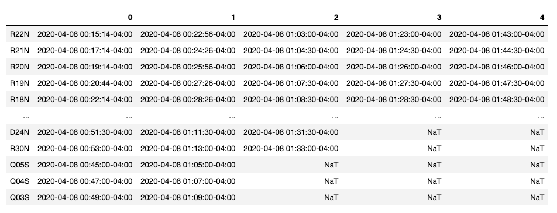
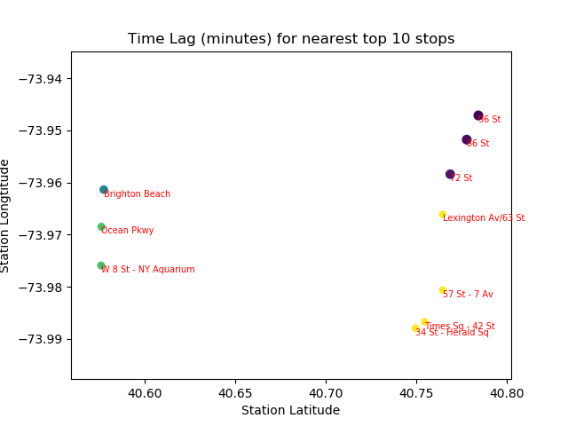
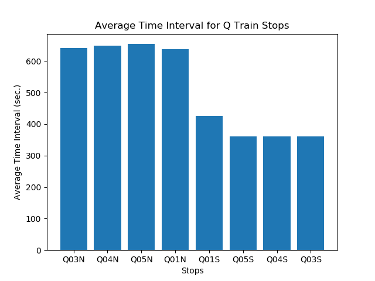

# HW7 API - NYC MTA API

Authors:  **Ling Lin**, **Xuanyu Lu** and **Qingyang Xiao**


---


## Introduction

Our team choose NYC MTA API to access its real-time data feed for analyses, the API key by MTA.
- *The type of data importing is All NYC 30 subway lines from route "1" to "SI", each line at all its stop_id expected arrival time.* 

- Route information:


- Specific train newest expected arrival time at each stop:


- Latitude and Longtitude of each subway stop:


- *The source of the data is provided on MTA website: (http://web.mta.info/developers/index.html).*  
- *By running our code, we see the data is updated real-time.*

To request data from the MTA, you'll also need a free API key.
[Register here](https://api.mta.info/).


---


## Sources

References for API
- The source code came from [a GitHub repository.](https://github.com/nolanbconaway/underground)
- The code retrieves data from [NYC MTA.](https://datamine.mta.info/)

References used in Transform API data to Python Dataframe section
- [Convert dataframe index to a new column](https://thispointer.com/pandas-convert-dataframe-index-into-column-using-dataframe-reset_index-in-python/)
- [Rename dataframe column](https://pandas.pydata.org/pandas-docs/stable/reference/api/pandas.DataFrame.rename.html)
- [Add a new column to a specific position of dataframe](https://discuss.codecademy.com/t/can-we-add-a-new-column-at-a-specific-position-in-a-pandas-dataframe/355842)
- [Extract time information from Timestamp data](https://pandas.pydata.org/pandas-docs/stable/reference/api/pandas.Timestamp.html)

References used in Data Visualization section
- [Add variable to plot title](https://stackoverflow.com/questions/43757820/how-to-add-a-variable-to-python-plt-title)
- [Lable data points on plot](https://stackoverflow.com/questions/14432557/matplotlib-scatter-plot-with-different-text-at-each-data-point)


---


## Explanation of the Code 

The code, `HW7_NYC_MTA_API.ipynb`, begins by importing necessary Python packages:
- Please refer to section **How to Run the Code** for instructions on packages installation
- os and underground packages are necessary for using MTA API
- Use a "magic command" to specify how we want our plots displayed
- %matplotlib notebook show the dynamic/interactive plot

```
import os
from underground import metadata, SubwayFeed

import pandas as pd

from datetime import date
from datetime import datetime

%matplotlib notebook
import matplotlib.pyplot as plt
```

<br/>

**In this section of code, we will import data from online API source.**

<br/>

First we need a free API key to request data from the MTA.
- Identify the route information we want to see, route Q is selected as example
- Get route feed

```
API_KEY = '            '    # import your API key
ROUTE = 'Q'  
feed = SubwayFeed.get(ROUTE, api_key=API_KEY)
```
- *NOTE: This API key only works with underground package version v3.*

Get route raw data of route Q and its expected arrival times
```
q_train_stops = feed.extract_stop_dict()[ROUTE]
q_train_stops
```

A snapshot of "q_train_stops" data is shown below:


<br/>

**In this section of code, we will transform the API data into a python dataframe.**

<br/>

The API data comes in as a dictionary format.
- Convert API data from dictionary format into a python dataframe
- Display the original dataframe
```
Schedule = pd.DataFrame.from_dict(q_train_stops, orient='index')
Schedule
```
A snapshot of "Schedule" dataframe is shown below:



The original index of "Schedule" dataframe is stop id.
- Add stop id (the index) to be a new column of the dataframe
- Rename the newly added column as "stop_id"
```
Schedule1 = Schedule.reset_index()
Schedule2 = Schedule1.rename(columns={'index':'stop_id'})
```

The last character of stop_id tells the direction of the stop (N represents North, S represents South).
- Read the last character of stop_id to identify the direction
- Insert the new direction column to a specific postion, e.g. column position 1 in this case
```
Direction = []

for i in range(0, len(Schedule)):
    Direction.append(Schedule2.stop_id[i][-1])
    
Schedule2.insert(1, 'direction', Direction)       
```
- *NOTE:  Do not run dataframe insert function code the second time without rerun the previous codes, because an error will appear if the column is already inserted.*

The original time columns are in Timestamp format, which contains both date and time information.
- Extract date information from the Timestamp column
- Create a new column for date and insert it to column position 2 of the dataframe
```
Schedule2.insert(2, 'date', Schedule2[0].dt.date)
```

Replace the original Timestamp columns (Timestamp shows both date and time) with time only
```
for j in range(0, len(Schedule2)):                   # loop through rows
    for k in range(3, len(Schedule2.iloc[0])):          # loop through columns 
        if pd.notna(Schedule2.iloc[j, k]):                 # checking for missing value
            Schedule2.iloc[j, k] = pd.Timestamp.time(Schedule2.iloc[j, k])
```            

Display the cleaned dataframe
```
Schedule2
```
A snapshot of "Schedule2" dataframe is shown below:


<br/>


**In this section of code, we will visualize the data and save them as png. images.**

<br/>

Plot 1: Scatter plot of top 10 stations waiting time if the passenger missing the upcoming one
- The longer the waiting time, the bigger the dots (x-axis: latitude, y-axis: longtitude). 

Find the nearest top 10 stations:
```
stop = []
for i in range(10):
    stop.append(sch_df.iloc[i]['stop_id'])
print(stop)
```

A text "stops.txt" also shows information coordinates for each stop:


The stops information can be read and stored as dataframe named "coord_df".
```
coord_df = pd.read_csv('stops.txt')
print(coord_df)
```
A snapshot of stops longtitude and latitude information shown in dataframe "coord_df":


Then the top 10 stations' names could be found respectively:
```
stop_name = []

for i in range(10):
    stop_name.append(coord_df.loc[coord_df['stop_id'] == stop[i],'stop_name'].values[0][0:20])
print(stop_name)
```

Find these 10 stops coordinates:
```
x_lat = []
for i in range(10):
    x_lat.append(coord_df.loc[coord_df['stop_id'] == stop[i],'stop_lat'].values[0])
print(x_lat)

x_lon = []
for i in range(10):
    x_lon.append(coord_df.loc[coord_df['stop_id'] == stop[i],'stop_lon'].values[0])
print(x_lon)
```

Then find time for these 10 stops, if missing upcoming train, how many minutes need wait for next one:
```
lag_min = []

for i in range(10):
    dt1 = datetime.combine(date.today(), sch_df.iloc[i].values[3])
    dt2 = datetime.combine(date.today(), sch_df.iloc[i].values[4])
    sec1 = dt2 - dt1
    lag = sec1.total_seconds()/60
    lag_min.append(lag)
print (lag_min)
```

Finally, we visualize the data. We save our plot as a png. image.

```
plt.title ('Time Lag (minutes) for nearest top 10 stops')
# plt.scatter (x_lat, x_lon, s = lag_min);

# Different color
colors = []
for i in range (10):
    colors.append( 1/ (lag_min [i]/float(max(lag_min))) )

plt.scatter(x_lat, x_lon, s = lag_t, c=colors , alpha =1);

# Color of the circle: Lighter the color, shorter the time lag
# Size of the circle: Smaller the circle, shorter the time lag

# Add text
for i in range (10):
    myx = x_lat[i]
    myy = x_lon[i]
    mystop = stop_name [i]
    plt. text (myx , myy , mystop , color ="red", fontsize =7,horizontalalignment='left',verticalalignment='top')
    
# x and y labels
plt.ylabel('Station Longtitude')
plt.xlabel('Station Latitude')
```

The output from this code is shown below:


<br/>


Plot 2: This plot illustrates the time gap between train arrivals for a pre-identified stop.
- First, identify the stop_id that we want to search
- In this case, we use stop 'Q05N' as the pre-identified stop
```
id = 'Q05N'
```

Identify the x and y variables for the plot
- Find the index that associates with the corresponding stop
- Find the schedule of that stop
- Drop the NAs in the data
- Set the x-values

```
index = int(Schedule2.index[Schedule2['stop_id'] == id].values)
times = Schedule2.iloc[index]
y = times.dropna()[3::]
x = range(0, len(y), 1)
```

Finally, we visualize the data. We save our plot as a png. image.
- Each line of code below correspondes to one of the adjustments, respectively.
	- Plot times data using matplotlib, adjust the plot size, plot title, x and y labels, graph a line plot, label data points, and save plot to png.
	
```
pd.plotting.register_matplotlib_converters()

plt.figure(figsize=(8, 5))

plt.title('Train Arrival Schedule of Stop: '+str(id)+' on '+str(times['date']))

plt.xlabel('Arrivals')
plt.ylabel('Time of Arrivals')

plt.plot(x, y, 'go-')

for i, txt in enumerate(y):
    plt.annotate(txt, (x[i]+0.3, y[i]))

plt.savefig('MTA_Plot1.png')
```

The output from this code is shown below:


<br/>

Plot 3: Average Time Interval of Q Train Stops

- This figure plots the average time interval for each Q train stops from the data source in order to show the busyness of the train station for further constrction purposes.

First, we select Q train stops from the dataframe and put it into a new dataframe q_schedule by looping through to select stops belong to Q train

```
index_list = list(Schedule.index)

index_q = []
for q in index_list:
    if 'Q' in q:
        index_q.append(q)
	
q_schedule = Schedule.loc[index_q, :]
```
Then, we calculate the time interval for all stops, compute the average and convert it into seconds for better visulization

```
time_interval = []
for i in range(len(q_schedule.columns)-1):
    time_interval.append(list(q_schedule[i+1] - q_schedule[i]))

# Convert time intervals from timedelta format to seconds
for a in range(len(time_interval)):
    for b in range(len(time_interval[a])):
        time_interval[a][b] = time_interval[a][b].total_seconds()

# Convert time interval data from lists to dataframe
time_interval_df = pd.DataFrame(time_interval)

# Calculate the average time interval of all stops
average_time_interval = list(time_interval_df.mean())
q_schedule['Average Time Interval'] = average_time_interval
```

Finally, plot the average time interval into bar chart for visulization and save it as png file

```
# Set labels and x axis of the plot
labels = list(q_schedule.index)
x = range(len(labels))

# Plot the Average Time Interval for different Q train stops
fig, ax = plt.subplots()

# Mark title, x and y axis labels

plt.bar(x, average_time_interval)
plt.xticks(x, labels)
ax.set_ylabel('Average Time Interval')
ax.set_xlabel('Stops')
ax.set_title('Average Time Interval for Q Train Stops');
```

The output from this code is shown below:



---


## How to Run the Code

From terminal window

1) Install the underground package
```
pip install underground
```

2) Change to the respective directory

3) Type the following command to open jupyter notebook
```
jupyter notebook
```
4) Download 'stops.text' file and save it into the same directory where this notebook is saved

5) Open the notebook file HW7_NYC_MTA_API.ipynb

6) Run through the codes, and plots will be shown and saved in the same directory.

---

## Suggestions
- Our API code above selected route "Q" in NYC MTA system as an example. Users can select any one of the 30 routes in MTA system that they wish to analyze.
- For the scatter plot, the plot can be drawn with more degree of distinction and the waiting time is better plotted on.
- In the time gap plot, users are also free to select any one of the train stops that they wish to know the arrival schedule of by modifying the "id" variable.
- Users can perform a subtraction between the arrivals (e.g. Arrival 2 time - Arrival 1 time) to calculate the actual time gap of the arrivals in minutes. Users then can plot this information to see how times between arrivals fluctuate. 


**Future Works**
- Match stop id with the acutal stop name by utilizing the provided stops.txt file
- This API provides the real-time MTA train arrival schedule. We can collect and compare the real-time schedule with the pre-set schedule to anaylze the early-arrivals or delays in MTA system.
